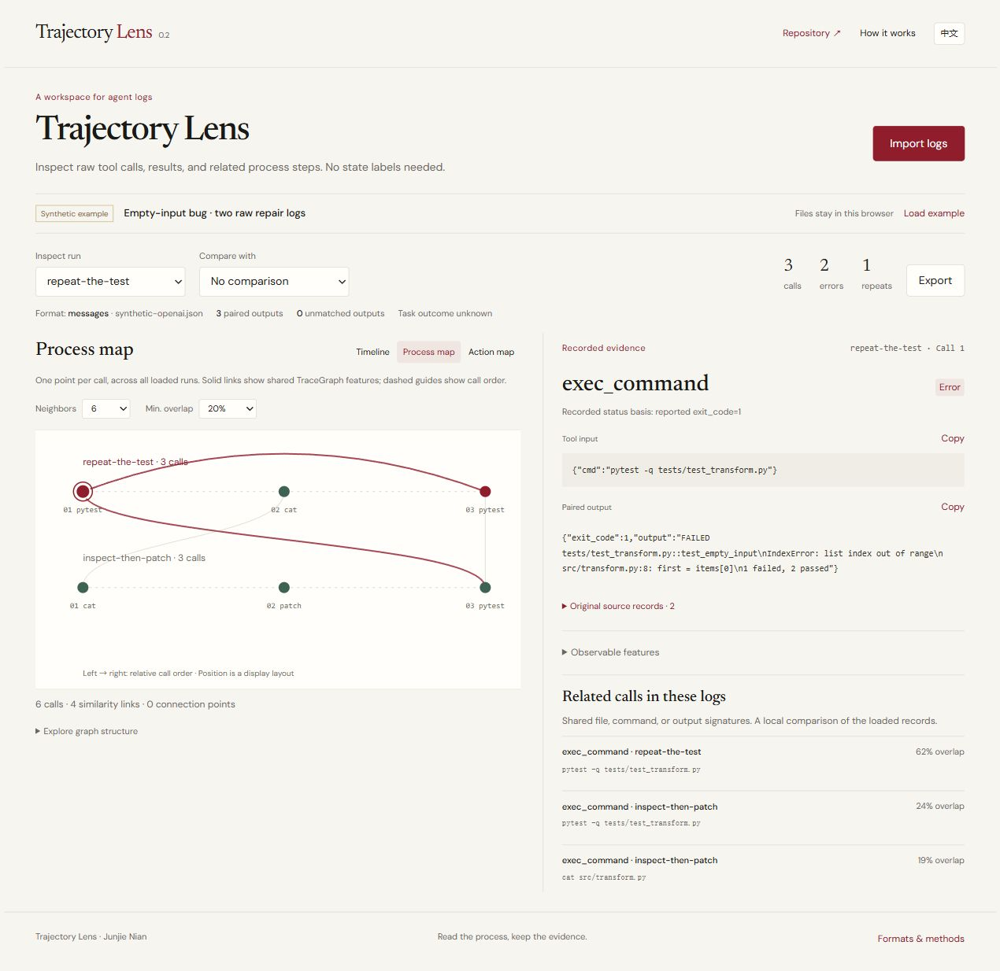

# Trajectory Lens

A small local workspace for understanding what an agent actually did: which tool
call failed, whether an input was repeated, where two runs first differed, and
which steps share observable files, commands, or output features.

Import raw logs. You do **not** need to write state IDs, annotate steps, or prepare
a graph first. English is the default; the Chinese switch preserves your loaded
data and selected event.



## Start here

- Open `artifacts/TrajectoryLens.html` directly for the single-file offline app.
- Or run `npm start` and open <http://127.0.0.1:8770/>. Node 20 or newer is required;
  there are no dependencies to install.
- Choose **Import logs**, select one or more files, or paste a raw log.
- Try `examples/codex-session.jsonl` to follow a failing test, a retry, a patch,
  and the same test passing. The file has five calls, two explicit errors, and
  two repeated inputs. It contains no manually assigned state labels.

The bundled examples are synthetic teaching records, not personal sessions or
experimental measurements. The app does not execute their commands.

## What the views show

| View | What a node or row means | What a connection means | Useful question |
| --- | --- | --- | --- |
| Timeline | One recorded tool invocation with its paired output | Original invocation order | Which command failed, and what happened next? |
| Process map | One invocation occurrence, across every loaded run | Undirected overlap of automatically extracted TraceGraph features | Which steps should I inspect together, even when the full arguments differ? |
| Action map | One exact tool name + canonical argument combination | Directed transition in recorded call order | Where did the same invocation recur? |

Click a row or graph point to see the full input, result, status basis, and
original source records. Open **Observable features** to inspect extracted keys
and their original matching fragments. **Related calls** takes you to other
records with nonzero feature overlap. Choose a second run to compare the exact
call sequence and jump to the first unequal invocation.

The process map places calls from left to right by their relative order in each
run. Separate lanes identify runs. Positions are a display layout, not a learned
embedding. Dashed order guides do not enter graph analysis. Solid similarity
links do. Change **Neighbors** or **Min. overlap** to inspect the displayed graph;
expand **Explore graph structure** to highlight its biconnected blocks and jump
to articulation points. Dotted rings mark these structural connection points.

## Input formats

The importer recognizes these native records without a conversion step:

- Codex JSONL response items: function calls, custom tool calls, and outputs.
- OpenAI Chat messages with `tool_calls` / `tool_call_id`, and Responses records.
- Anthropic `tool_use` / `tool_result` content blocks.
- Generic action/observation records and SWE-agent `.traj` trajectories.
- TraceGraph parsed rollouts with `raw_action`, `raw_observation`, and `tool_name`.
- Trajectory Lens canonical raw JSON, including exported original evidence.

Matching call IDs pair delayed or parallel results to the correct invocation.
Ambiguous reused IDs and unmatched outputs remain separately inspectable with
import notes. The importer does not guess pairs from proximity. Formats with an
embedded action/observation pair retain that documented source pairing.

Files are limited to 10 MB each and 20 MB per import. The optional process map is
disabled above 300 invocations; the action map above 80 unique invocations. No
records are silently sampled. The timeline, features, related search, and raw
JSON export remain available for the complete imported data.

## How TraceGraph is used

This project adapts the actual public
[TraceGraph source](https://github.com/JunjieNian/TraceGraph/tree/bc830d534b6d75174a7ada89e786f6f5b6b35402),
pinned at `bc830d534b6d75174a7ada89e786f6f5b6b35402`:

1. Extract observable tool, command, file, diff, observation, and temporal-phase
   keys from each invocation and paired result.
2. Compute `idf(key) = log((1 + N) / (1 + df(key)))` over all loaded invocations.
3. Compare key sets using IDF-weighted Jaccard; preserve upstream float32 pairwise
   distance behavior.
4. Construct reciprocal k-nearest-neighbor links and
   `exp(-distance / 0.35)` edge weights.
5. Apply the viewer's minimum-overlap filter, then use the upstream iterative
   Tarjan algorithms for biconnected blocks and articulation points.

Codex tool names, Windows and relative paths, source evidence, and browser
controls are explicit extensions. See [THIRD_PARTY_NOTICES.md](THIRD_PARTY_NOTICES.md)
for source links and differences. Golden fixtures were generated by running the
actual pinned Python implementation, including its structural algorithms.

## Read the evidence correctly

Exact repeats use the full tool name and canonical arguments. Object key order
is normalized; tool, path and command case remain significant. Transport IDs do
not define equivalence between invocations. Unsafe numeric JSON arguments retain
their exact source text rather than being rounded into false repeats.

Feature similarity is a different measure. A file signature retains only its
last two path components, and observation keys are regex matches. They can match
quoted documentation or source listings. `OBS:IndexError` therefore does not
establish that a command failed. Actual status uses explicit structured fields,
exit codes, or documented Codex result wrappers. Missing status stays unknown;
an empty recorded output is distinct from an unreturned call.

Keys present in every loaded call have zero IDF weight. A zero-weight union has
zero similarity, including a single-call dataset. Similarity depends on the
loaded corpus; a small sample can change the apparent connections considerably.
Two-node bridges are marked separately from larger blocks; articulation points
can belong to multiple blocks; isolated points belong to none.

A repeated input can be useful verification. A graph block is a structure, not a
trap, successful region, or reward estimate. This viewer does not implement
TraceGraph reward propagation, outcome diffusion, recovery gates, or paper
results. Whole-task outcome remains unknown unless explicitly supplied by the
source records.

## Keep or share your analysis

**Export** offers a Markdown report, canonical raw JSON, and both SVG maps. The
report includes the selected comparison and process-graph settings. Canonical
JSON preserves original record text, pairings, status evidence, and automatic
features. Refreshing or closing the page clears imported logs; export first if
you want to keep them.

Processing runs in this browser with no LLM/API calls and no upload. There is no
analytics or server storage. The optional Google Fonts stylesheet requests fonts
online; fallback fonts work offline. No imported log content is sent for fonts.

## Develop and verify

```text
npm test
npm run build
node scripts/package.cjs
```

Tests cover native exporters, exact-ID pairing, ambiguous/orphan results,
explicit status, numeric argument identity, source-preserving round trips, and
parity with TraceGraph feature, distance, neighbor, and structural outputs.
`npm run build` embeds the app into `artifacts/TrajectoryLens.html`.
The packaging script creates `artifacts/TrajectoryLens-source.zip`, including
editable source, examples, tests, docs, the new offline app, and the preserved
original deliverables. The reference checkout, Git metadata, and private traces
are excluded.

## Original version and website withdrawal

The original offline HTML and source ZIP are preserved unchanged in `archive/`.
`archive/site-v0.1/` holds the former website implementation. Version 0.2 is an
independent project in `D:\TrajectoryLens` with its own private GitHub repository.
The personal website's card, research-page links, sitemap URL, and former tool
directory were removed. This project is not hosted there.

Apache License 2.0. See [LICENSE](LICENSE) and
[THIRD_PARTY_NOTICES.md](THIRD_PARTY_NOTICES.md).
